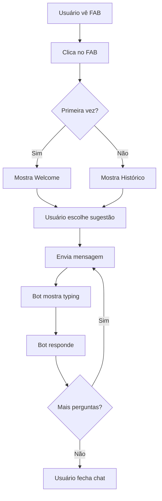

# Documentação da Interface do Chatbot - GUIA.ME

**Autor**: Manus AI  
**Data**: 12 de Outubro de 2025

## 1. Visão Geral

A interface do chatbot do **GUIA.ME** foi projetada para ser um assistente virtual inteligente e acessível, disponível em todas as telas do aplicativo. O design combina modernidade, funcionalidade e uma experiência conversacional natural, permitindo que os usuários obtenham informações sobre Brasília de forma rápida e intuitiva.

## 2. Objetivos do Design

O design da interface do chatbot foi desenvolvido com os seguintes objetivos estratégicos:

1. **Acessibilidade Universal**: Estar sempre disponível através de um botão flutuante
2. **Identidade Amigável**: Transmitir confiança e tecnologia através do design
3. **Experiência Conversacional**: Criar interações naturais e fluidas
4. **Integração Visual**: Manter consistência com a identidade do GUIA.ME
5. **Performance**: Garantir carregamento rápido e interações responsivas

## 3. Componentes da Interface

### 3.1. Botão Flutuante (FAB - Floating Action Button)

O ponto de entrada principal para o chatbot é um botão flutuante fixo que permanece visível em todas as telas.

#### Características Visuais

| Propriedade | Valor | Justificativa |
|-------------|-------|---------------|
| Tamanho | 64x64px | Grande o suficiente para fácil toque |
| Posição | Inferior direito | Convenção de UX para FABs |
| Cor | Gradiente azul | Alinhado com identidade do app |
| Ícone | 💬 (emoji de chat) | Universalmente reconhecido |
| Badge | "IA" em vermelho | Destaca uso de inteligência artificial |

#### Estados do Botão

1. **Estado Normal**:
   - Gradiente azul (secondary → primary)
   - Animação de pulso sutil
   - Sombra pronunciada

2. **Estado Hover**:
   - Escala aumenta 10%
   - Sombra mais intensa
   - Transição suave

3. **Estado Ativo** (chat aberto):
   - Rotação de 45°
   - Cor cinza
   - Ícone vira "X" para fechar

#### Animação de Pulso

```css
@keyframes pulse {
    0%, 100% {
        box-shadow: 0 4px 20px rgba(0, 71, 171, 0.4);
    }
    50% {
        box-shadow: 0 4px 20px rgba(0, 71, 171, 0.4), 
                    0 0 0 12px rgba(0, 71, 171, 0.1);
    }
}
```

A animação de pulso chama atenção do usuário de forma não intrusiva, indicando que o assistente está disponível.

### 3.2. Janela de Chat

Quando o usuário clica no FAB, uma janela de chat elegante aparece acima do botão.

#### Dimensões e Posicionamento

| Dispositivo | Largura | Altura | Posição |
|-------------|---------|--------|---------|
| Desktop | 400px | 600px | Bottom-right (32px margin) |
| Tablet | 400px | 600px | Bottom-right (32px margin) |
| Mobile | calc(100vw - 32px) | calc(100vh - 140px) | Bottom-right (16px margin) |

#### Estrutura da Janela

A janela é dividida em três seções principais:

1. **Header** (topo)
2. **Messages Area** (meio, scrollável)
3. **Input Area** (rodapé)

### 3.3. Header do Chat

O cabeçalho estabelece a identidade do assistente e fornece controles básicos.

#### Componentes do Header

**Avatar do Bot**:
- Círculo branco de 48x48px
- Emoji de robô (🤖)
- Contraste com fundo gradiente

**Informações do Bot**:
- **Título**: "Guia IA Brasília" (16px, bold)
- **Status**: "Online agora" com indicador verde pulsante
- Cor branca sobre gradiente azul

**Botão de Fechar**:
- Círculo semi-transparente
- Ícone "X"
- Hover com aumento de opacidade

#### Gradiente do Header

O header utiliza o mesmo gradiente da identidade do app:
```css
background: linear-gradient(135deg, #4A90E2 0%, #0047AB 100%);
```

### 3.4. Área de Mensagens

A área central onde a conversa acontece, com scroll automático para novas mensagens.

#### Tipos de Mensagem

##### 1. Mensagens do Bot

**Estrutura**:
- Avatar do bot à esquerda
- Balão branco com texto
- Timestamp abaixo
- Borda inferior esquerda arredondada reduzida (efeito "cauda")

**Elementos Adicionais**:
- **Quick Replies**: Botões de resposta rápida
- **Suggestion Cards**: Cards clicáveis com informações de locais
- **Typing Indicator**: Animação de "digitando..."

##### 2. Mensagens do Usuário

**Estrutura**:
- Avatar do usuário à direita
- Balão azul com texto branco
- Timestamp abaixo à direita
- Borda inferior direita arredondada reduzida

**Diferenciação Visual**:
- Cor de fundo: Azul primário (#0047AB)
- Alinhamento: Direita
- Avatar: Emoji de pessoa (👤) com fundo dourado

#### Quick Replies (Respostas Rápidas)

Botões que aparecem abaixo de mensagens do bot para facilitar respostas comuns.

**Design**:
- Fundo branco com borda azul
- Texto azul, bold
- Hover: Fundo azul, texto branco
- Padding: 8px 16px
- Border-radius: 20px (pill shape)

**Exemplos**:
- 🏛️ Monumentos
- 🍽️ Restaurantes
- 🎭 Eventos

#### Suggestion Cards

Cards informativos que podem ser clicados para obter mais detalhes.

**Estrutura**:
```
┌─────────────────────────────┐
│ 🏛️ Catedral Metropolitana  │
│ Obra-prima • 2.5 km • ⭐ 4.8│
└─────────────────────────────┘
```

**Interação**:
- Hover: Borda azul, elevação
- Click: Navega para detalhes do local

#### Typing Indicator

Animação que indica que o bot está "pensando" ou "digitando".

**Componentes**:
- 3 pontos cinzas
- Animação sequencial de subida/descida
- Timing: 1.4s loop infinito

### 3.5. Área de Input

Seção inferior onde o usuário digita suas mensagens.

#### Componentes

**Campo de Texto**:
- Textarea expansível (até 100px de altura)
- Placeholder: "Digite sua mensagem..."
- Borda arredondada (24px)
- Auto-resize conforme usuário digita

**Botão de Envio**:
- Círculo azul de 44x44px
- Ícone de seta (➤)
- Desabilitado quando campo vazio
- Hover: Escala e cor mais escura

#### Funcionalidades

1. **Enter para Enviar**: Pressionar Enter envia a mensagem
2. **Shift+Enter**: Nova linha
3. **Auto-resize**: Campo cresce até limite máximo
4. **Desabilitar quando vazio**: Botão fica cinza

### 3.6. Estado de Boas-Vindas

Quando o usuário abre o chat pela primeira vez, uma tela de boas-vindas é exibida.

#### Estrutura

**Ícone Central**:
- Emoji de robô grande (64px)
- Centralizado

**Título e Descrição**:
- "Olá! Sou o Guia IA" (20px, bold)
- Texto explicativo abaixo

**Sugestões Iniciais**:
Grid de 4 cards clicáveis com opções comuns:

1. **🏛️ Explorar Monumentos**
   - "Descubra a arquitetura de Niemeyer"

2. **🗺️ Criar Roteiro**
   - "Roteiro personalizado para você"

3. **🍽️ Onde Comer**
   - "Melhores restaurantes da cidade"

4. **🎭 Eventos Hoje**
   - "O que está acontecendo agora"

## 4. Fluxo de Interação

### 4.1. Fluxo Básico



### 4.2. Tipos de Resposta do Bot

O bot pode responder de diferentes formas:

1. **Texto Simples**: Resposta direta em texto
2. **Texto + Quick Replies**: Resposta com opções de continuação
3. **Texto + Cards**: Resposta com sugestões de locais
4. **Cards Múltiplos**: Lista de recomendações

## 5. Paleta de Cores

### Cores Principais

| Elemento | Cor | Hex | Uso |
|----------|-----|-----|-----|
| Bot Message Background | Branco | `#FFFFFF` | Fundo das mensagens do bot |
| User Message Background | Azul Brasília | `#0047AB` | Fundo das mensagens do usuário |
| Header Background | Gradiente | `#4A90E2 → #0047AB` | Fundo do cabeçalho |
| FAB Background | Gradiente | `#4A90E2 → #0047AB` | Botão flutuante |
| Badge | Vermelho | `#E53935` | Badge "IA" |
| Status Indicator | Verde | `#4CAF50` | Indicador "online" |
| Border | Cinza claro | `#E0E0E0` | Bordas e divisores |

## 6. Tipografia

| Elemento | Tamanho | Peso | Uso |
|----------|---------|------|-----|
| Header Title | 16px | 700 | Título do bot |
| Header Status | 12px | 400 | Status "online" |
| Message Text | 14px | 400 | Texto das mensagens |
| Message Time | 11px | 400 | Timestamp |
| Quick Reply | 13px | 600 | Botões de resposta rápida |
| Welcome Title | 20px | 700 | Título de boas-vindas |
| Suggestion Title | 14px | 600 | Título dos cards |

## 7. Animações e Transições

### Animações Implementadas

1. **Slide Up** (abertura da janela):
   - Duração: 0.3s
   - Easing: ease-out
   - Efeito: Desliza de baixo com fade in

2. **Pulse** (FAB):
   - Duração: 2s
   - Loop: Infinito
   - Efeito: Expansão sutil da sombra

3. **Typing Indicator**:
   - Duração: 1.4s por ciclo
   - Loop: Infinito
   - Efeito: Pontos sobem e descem

4. **Fade In** (mensagens):
   - Duração: 0.3s
   - Efeito: Aparece com movimento de baixo para cima

5. **Status Blink** (indicador online):
   - Duração: 2s
   - Loop: Infinito
   - Efeito: Opacidade varia

### Transições

Todas as transições usam `cubic-bezier(0.175, 0.885, 0.32, 1.275)` para movimento natural e "bouncy".

## 8. Responsividade

### Breakpoints

**Desktop (> 768px)**:
- Janela: 400x600px
- FAB: 64x64px
- Margem: 32px

**Mobile (≤ 768px)**:
- Janela: Largura total menos 32px
- Altura: Viewport menos 140px
- FAB: 64x64px
- Margem: 16px

### Adaptações Mobile

1. **Janela ocupa quase tela toda**: Melhor aproveitamento do espaço
2. **FAB menor margem**: Mais acessível para polegar
3. **Input maior**: Facilita digitação em teclado virtual

## 9. Acessibilidade

### Práticas Implementadas

1. **Contraste**: WCAG AA em todos os textos
2. **Tamanhos de Toque**: Mínimo 44x44px
3. **Estados de Foco**: Indicadores visuais claros
4. **Navegação por Teclado**: Enter para enviar, Tab para navegar
5. **Scrollbar Customizada**: Visível mas discreta
6. **Timestamps**: Contexto temporal para todas as mensagens

## 10. Funcionalidades Futuras

Recomendações para evolução:

1. **Reconhecimento de Voz**: Permitir mensagens por voz
2. **Compartilhamento**: Compartilhar conversas ou recomendações
3. **Histórico Persistente**: Salvar conversas anteriores
4. **Anexos**: Enviar fotos de locais
5. **Tradução**: Suporte multilíngue
6. **Notificações**: Alertas proativos sobre eventos
7. **Modo Escuro**: Tema dark para uso noturno
8. **Integração com Calendário**: Adicionar eventos diretamente

## 11. Integração com IA

### Capacidades do Assistente

O chatbot deve ser capaz de:

1. **Responder Perguntas**: Sobre pontos turísticos, horários, preços
2. **Criar Roteiros**: Baseado em preferências e tempo disponível
3. **Recomendar Locais**: Personalizados por perfil do usuário
4. **Fornecer Direções**: Integração com mapas
5. **Informar Eventos**: O que está acontecendo na cidade
6. **Sugerir Restaurantes**: Baseado em culinária e localização
7. **Contextualizar**: Entender conversas anteriores

### Tipos de Entrada

O bot deve processar:

- Perguntas diretas ("Onde fica a Catedral?")
- Comandos ("Mostre restaurantes perto de mim")
- Preferências ("Gosto de arquitetura modernista")
- Contexto ("E o horário de funcionamento?")

## 12. Performance

### Otimizações

1. **Lazy Loading**: Mensagens antigas carregam sob demanda
2. **Virtual Scrolling**: Para conversas muito longas
3. **Debouncing**: Otimização de eventos de input
4. **CSS Animations**: Uso de transform e opacity
5. **Código Limpo**: JavaScript vanilla sem dependências

## 13. Conclusão

A interface do chatbot do **GUIA.ME** estabelece um novo padrão de assistência turística digital, combinando design moderno, interações naturais e tecnologia de ponta. O FAB sempre acessível garante que os usuários tenham ajuda instantânea em qualquer momento de sua jornada por Brasília, enquanto a interface conversacional torna a experiência intuitiva e agradável.

---

## Referências

1. Material Design. (2024). *Floating Action Button - Material Design*. [https://material.io/components/buttons-floating-action-button](https://material.io/components/buttons-floating-action-button)
2. Nielsen Norman Group. (2024). *Chatbots: Design Guidelines*. [https://www.nngroup.com/articles/chatbots/](https://www.nngroup.com/articles/chatbots/)
3. Intercom. (2024). *Conversational UI Design Best Practices*. [https://www.intercom.com/](https://www.intercom.com/)
4. Google. (2024). *Conversation Design Guidelines*. [https://developers.google.com/assistant/conversation-design](https://developers.google.com/assistant/conversation-design)

