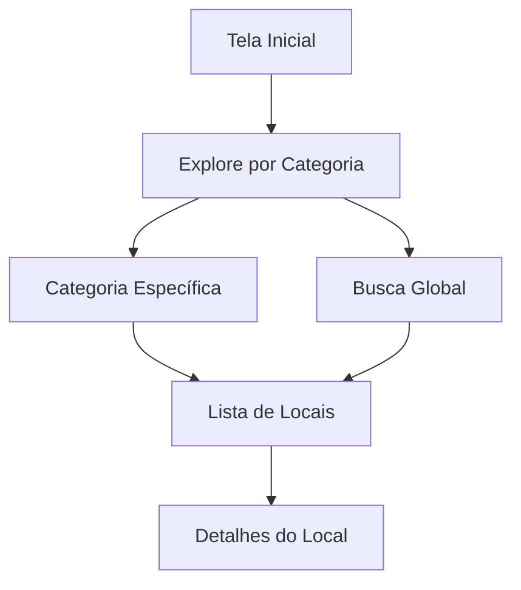

# Documentação do Design - Explore por Categoria 
**Data**: 12 de Outubro de 2025

## 1. Visão Geral

A tela **Explore por Categoria** do **GUIA.ME** foi projetada para ser o hub central de navegação do aplicativo, permitindo que os usuários descubram facilmente os diferentes tipos de experiências turísticas disponíveis em Brasília. O design prioriza clareza visual, facilidade de navegação e uma estética moderna que reflete a inovação do projeto.

## 2. Objetivos do Design

O design desta tela foi desenvolvido com os seguintes objetivos:

1. **Organização Clara**: Apresentar as seis categorias de forma visualmente distinta e organizada
2. **Navegação Intuitiva**: Facilitar o acesso rápido às diferentes categorias de interesse
3. **Identidade Visual Forte**: Utilizar cores e ícones que representem claramente cada categoria
4. **Engajamento Visual**: Criar uma experiência interativa e atraente através de animações e efeitos
5. **Acessibilidade**: Garantir que todos os usuários possam navegar facilmente pelo conteúdo

## 3. Estrutura da Interface

### 3.1. Header (Cabeçalho)

O cabeçalho mantém consistência com o restante do aplicativo, oferecendo navegação simples.

**Componentes**:
- **Botão Voltar**: Círculo com seta para retornar à tela anterior
- **Título da Página**: "Categorias" para contexto imediato

### 3.2. Page Header (Cabeçalho da Página)

Seção de introdução que estabelece o contexto da página.

**Elementos**:
- **Título Principal**: "Explore Brasília" com gradiente azul
- **Subtítulo**: Descrição breve da funcionalidade
- **Animação**: Fade in down para entrada suave

### 3.3. Seção de Busca

Ferramenta de busca global que permite pesquisar em todas as categorias simultaneamente.

**Funcionalidades**:
- Campo de entrada amplo e acessível
- Botão de busca destacado
- Placeholder descritivo
- Suporte para tecla Enter

### 3.4. Seção de Estatísticas

Cards informativos que estabelecem credibilidade e escopo do conteúdo.

| Estatística | Valor | Significado |
|-------------|-------|-------------|
| Locais Cadastrados | 850+ | Amplitude do catálogo |
| Categorias | 6 | Organização do conteúdo |
| Avaliação Média | 4.8 | Qualidade dos locais |

### 3.5. Grid de Categorias

O elemento central da interface, apresentando as seis categorias principais em um layout de grade responsivo.

## 4. Design das Categorias

Cada categoria foi cuidadosamente projetada com identidade visual única, mantendo consistência no layout.

### 4.1. Estrutura dos Cards

**Componentes de cada card**:
1. **Container de Ícone**: Círculo com gradiente da cor da categoria
2. **Ícone Emoji**: Representação visual imediata da categoria
3. **Título**: Nome da categoria em tipografia bold
4. **Descrição**: Texto explicativo sobre o conteúdo da categoria
5. **Contador**: Badge com número de locais disponíveis

### 4.2. Paleta de Cores por Categoria

Cada categoria possui uma cor primária única que a identifica visualmente:

| Categoria | Cor Principal | Hex | Significado |
|-----------|---------------|-----|-------------|
| **Monumentos** | Azul Brasília | `#0047AB` | Seriedade, história, institucional |
| **Arte & Cultura** | Roxo | `#9B59B6` | Criatividade, sofisticação, arte |
| **Gastronomia** | Laranja | `#FF6B35` | Energia, apetite, calor |
| **Natureza** | Verde | `#27AE60` | Natureza, sustentabilidade, vida |
| **Compras** | Vermelho | `#E74C3C` | Urgência, paixão, ação |
| **Eventos** | Amarelo-Ouro | `#F39C12` | Celebração, alegria, festividade |

### 4.3. Ícones das Categorias

Os ícones foram escolhidos para representar claramente cada categoria:

- 🏛️ **Monumentos**: Edifício clássico com colunas
- 🎨 **Arte & Cultura**: Paleta de pintura
- 🍽️ **Gastronomia**: Prato com talheres
- 🌳 **Natureza**: Árvore
- 🛍️ **Compras**: Sacola de compras
- 🎭 **Eventos**: Máscaras teatrais

## 5. Interações e Animações

O design incorpora múltiplas camadas de interatividade para criar uma experiência envolvente:

### 5.1. Efeitos de Hover

Quando o usuário passa o mouse sobre um card de categoria:

1. **Elevação**: Card sobe 12px com animação suave
2. **Escala**: Leve aumento de 2% no tamanho
3. **Sombra**: Sombra mais pronunciada para criar profundidade
4. **Borda**: Borda colorida aparece na cor da categoria
5. **Ícone**: Rotação de 5° e aumento de escala de 10%
6. **Título**: Muda para a cor da categoria
7. **Badge**: Fundo muda para a cor da categoria com texto branco
8. **Background**: Gradiente sutil da cor da categoria aparece

### 5.2. Animações de Entrada

**Sequência de animação**:
1. **Page Header**: Fade in down (0s)
2. **Search Section**: Fade in up (0.2s)
3. **Stats Section**: Fade in up (0.4s)
4. **Category Cards**: Fade in up sequencial (100ms de delay entre cada)

### 5.3. Efeito Ripple

Ao clicar em um card, um efeito ripple (ondulação) é criado no ponto de clique, proporcionando feedback visual imediato.

## 6. Descrições das Categorias

Cada categoria possui uma descrição específica que comunica claramente seu conteúdo:

### 🏛️ Monumentos
**Descrição**: "Explore a arquitetura modernista de Oscar Niemeyer e os marcos históricos da capital"

**Conteúdo típico**:
- Catedral Metropolitana
- Congresso Nacional
- Palácio da Alvorada
- Palácio do Planalto
- Memorial JK

### 🎨 Arte & Cultura
**Descrição**: "Museus, galerias de arte, teatros e centros culturais que celebram a cultura brasileira"

**Conteúdo típico**:
- Museu Nacional
- Teatro Nacional
- Centro Cultural Banco do Brasil
- Fundação Athos Bulcão

### 🍽️ Gastronomia
**Descrição**: "Restaurantes, bares e cafés que oferecem o melhor da culinária local e internacional"

**Conteúdo típico**:
- Restaurantes premiados
- Bares e pubs
- Cafeterias especializadas
- Food trucks
- Feiras gastronômicas

### 🌳 Natureza
**Descrição**: "Parques, jardins, trilhas e áreas verdes para relaxar e se conectar com a natureza"

**Conteúdo típico**:
- Parque da Cidade
- Jardim Botânico
- Parque Nacional de Brasília
- Ermida Dom Bosco
- Lago Paranoá

### 🛍️ Compras
**Descrição**: "Shoppings, feiras de artesanato e lojas especializadas para todas as suas necessidades"

**Conteúdo típico**:
- Shopping centers
- Feira da Torre
- Feira do Guará
- Lojas de design local

### 🎭 Eventos
**Descrição**: "Shows, festivais, exposições e eventos culturais acontecendo agora em Brasília"

**Conteúdo típico**:
- Festivais de música
- Exposições temporárias
- Shows e concertos
- Eventos esportivos
- Feiras e convenções

## 7. Layout Responsivo

O design adapta-se elegantemente a diferentes tamanhos de tela:

### Desktop (> 768px)
- Grid de 2-3 colunas dependendo da largura
- Cards com tamanho generoso
- Todos os efeitos de hover ativos

### Tablet (768px)
- Grid de 2 colunas
- Redução moderada no tamanho dos elementos
- Manutenção de todas as funcionalidades

### Mobile (< 768px)
- Grid de 1 coluna
- Cards em largura total
- Ícones ligeiramente menores (100px vs 120px)
- Busca em layout vertical
- Stats em 2 colunas

### Mobile Pequeno (< 480px)
- Padding reduzido
- Stats em 1 coluna
- Otimização máxima de espaço

## 8. Acessibilidade

Práticas de acessibilidade implementadas:

1. **Contraste**: Todas as combinações de cor atendem WCAG AA
2. **Tamanhos de Toque**: Mínimo de 44x44px para elementos interativos
3. **Hierarquia Semântica**: Tags HTML apropriadas (h1, h2, etc.)
4. **Estados de Foco**: Indicadores visuais claros
5. **Texto Alternativo**: Descrições claras para todos os elementos visuais
6. **Navegação por Teclado**: Todos os elementos são acessíveis via teclado

## 9. Performance

Otimizações implementadas:

- **Lazy Loading**: Cards animam apenas quando entram no viewport
- **CSS Animations**: Uso de transform e opacity para animações performáticas
- **Debouncing**: Otimização de eventos de scroll
- **Código Limpo**: JavaScript vanilla sem dependências pesadas

## 10. Fluxo de Navegação

## 11. Próximos Passos

Recomendações para evolução:

1. **Filtros Avançados**: Adicionar filtros por distância, avaliação, preço
2. **Favoritos**: Permitir salvar categorias favoritas
3. **Personalização**: Ordenar categorias por preferências do usuário
4. **Badges Dinâmicos**: Mostrar "Novo", "Popular", "Próximo"
5. **Preview ao Hover**: Mostrar preview dos locais da categoria
6. **Integração com IA**: Sugestões personalizadas de categorias

## 12. Conclusão

A tela **Explore por Categoria** estabelece uma base sólida para a navegação do **GUIA.ME**, combinando design moderno, interatividade rica e organização clara. A identidade visual única de cada categoria facilita o reconhecimento e a navegação, enquanto as animações e efeitos criam uma experiência envolvente e memorável.

---

## Referências

1. Material Design. (2024). *Cards - Material Design*. [https://material.io/components/cards](https://material.io/components/cards)
2. Nielsen Norman Group. (2024). *Category Pages: Design for Scannability*. [https://www.nngroup.com/articles/category-pages/](https://www.nngroup.com/articles/category-pages/)
3. Smashing Magazine. (2024). *Best Practices for Animated Micro-Interactions*. [https://www.smashingmagazine.com/](https://www.smashingmagazine.com/)

