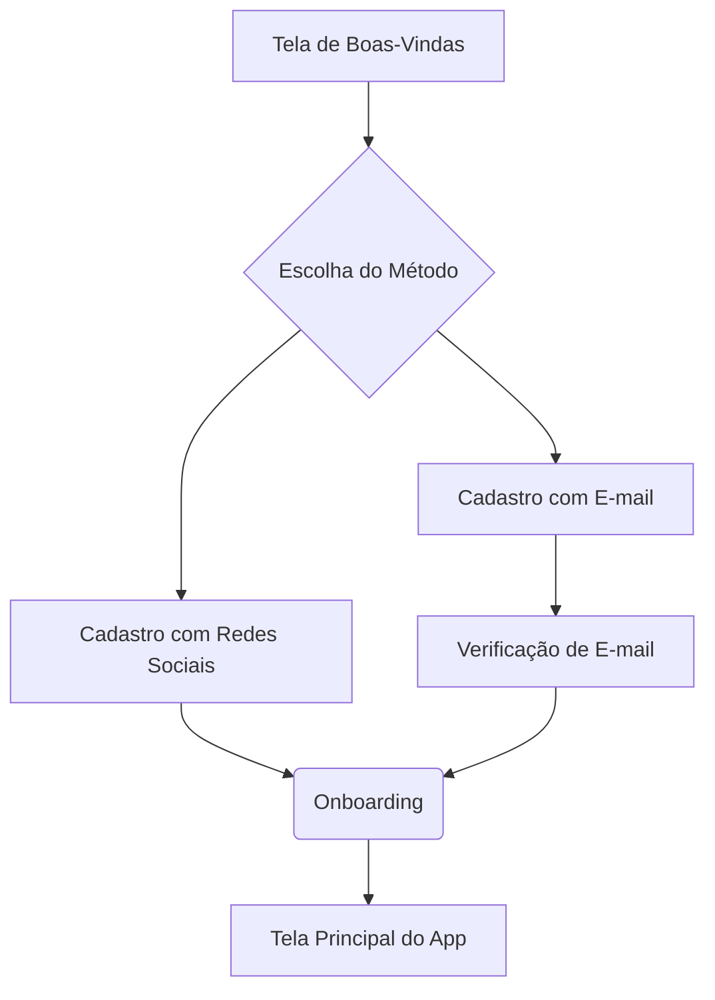

# Documentação do Design de Cadastro - GUIA.ME

**Autor**: Manus AI
**Data**: 12 de Outubro de 2025

## 1. Introdução

Este documento detalha o processo de design e desenvolvimento das telas de cadastro para o WebApp **GUIA.ME**, um guia turístico inovador para Brasília. O objetivo foi criar um fluxo de cadastro intuitivo, atraente e alinhado com a identidade do projeto, garantindo uma experiência de usuário (UX) minimalista e moderna que captura informações essenciais para a personalização da jornada turística.

O design foi concebido para ser rápido e não-burocrático, oferecendo múltiplas opções de cadastro e coletando apenas os dados estritamente necessários para o funcionamento do aplicativo, sempre com foco na modernidade e inovação que caracterizam o **GUIA.ME**.

## 2. Identidade Visual

A identidade visual do **GUIA.ME** foi construída sobre pilares que remetem à Brasília: **modernidade, sofisticação, inovação e brasilidade**. A arquitetura de Oscar Niemeyer e as cores do planalto central serviram como principal fonte de inspiração.

### 2.1. Paleta de Cores

A paleta de cores foi escolhida para refletir a identidade visual de Brasília, com tons de azul e branco como cores primárias, e cores secundárias que remetem ao cerrado e à modernidade.

| Cor                 | Hex       | Uso Principal                                    |
| ------------------- | --------- | ------------------------------------------------ |
| **Azul Brasília**   | `#0047AB` | Botões primários, links, elementos interativos   |
| **Branco Puro**     | `#FFFFFF` | Fundos principais, cards, áreas de conteúdo      |
| **Azul Celeste**    | `#4A90E2` | Elementos secundários, hovers, ícones            |
| **Dourado Planalto**| `#D4AF37` | Destaques, badges, elementos especiais         |
| **Verde Cerrado**   | `#6B8E23` | Mensagens de sucesso, confirmações             |
| **Cinza Concreto**  | `#F5F5F5` | Fundos secundários, áreas de separação         |
| **Cinza Escuro**    | `#212121` | Textos principais, títulos                     |

### 2.2. Tipografia

A fonte principal escolhida foi a **Inter**, uma tipografia moderna, versátil e de alta legibilidade em interfaces digitais, disponível no Google Fonts. A hierarquia foi definida para garantir clareza e consistência visual em todo o aplicativo.

- **Títulos Principais (H1)**: Inter Bold, 32px
- **Títulos de Seção (H2)**: Inter SemiBold, 24px
- **Corpo de Texto**: Inter Regular, 16px
- **Botões**: Inter SemiBold, 16px

## 3. Arquitetura da Informação e Fluxo de Usuário

O fluxo de cadastro foi projetado para ser modular e de baixa fricção, permitindo que o usuário entre no aplicativo o mais rápido possível, enquanto ainda oferece oportunidades para personalização.

O fluxograma abaixo ilustra o caminho principal do usuário:

### Telas Principais

1.  **Tela de Boas-Vindas**: Apresenta a proposta de valor do **GUIA.ME** com uma ilustração minimalista dos monumentos de Brasília.
2.  **Escolha do Método de Cadastro**: Oferece opções de login social (Google, Facebook, Apple) e cadastro via e-mail para conveniência do usuário.
3.  **Formulário de Cadastro**: Coleta apenas o essencial: nome, e-mail e senha, seguindo as melhores práticas de UX, como validação em tempo real e indicador de força de senha.
4.  **Verificação de E-mail**: Etapa de segurança para confirmar a posse do e-mail através de um código de 6 dígitos.
5.  **Onboarding Personalizado**: Um fluxo opcional de 3 passos para coletar interesses do usuário, seu perfil (turista ou morador) e preferências de notificação, permitindo a personalização da experiência desde o início.
6.  **Tela de Boas-Vindas Final**: Confirma o sucesso do cadastro e dá as boas-vindas ao usuário de forma personalizada.

## 4. Entregáveis de Design

Todos os artefatos de design criados durante o projeto estão disponíveis para consulta e utilização.

### 4.1. Pesquisa e Referências

Os documentos de pesquisa, que consolidam as melhores práticas de UX para formulários de cadastro e a análise da identidade visual de Brasília, serviram como base para todas as decisões de design.

- [Pesquisa de Melhores Práticas de Cadastro](./pesquisa_cadastro.md)
- [Análise da Identidade Visual de Brasília](./identidade_visual_brasilia.md)

### 4.2. Wireframes

Os wireframes de baixa fidelidade foram criados para estruturar o conteúdo e a hierarquia de cada tela do fluxo de cadastro. Eles podem ser visualizados no arquivo HTML abaixo.

- [Wireframes Interativos](./wireframes.html)

### 4.3. Protótipo de Alta Fidelidade

Um protótipo interativo e de alta fidelidade foi desenvolvido para simular a experiência real do usuário. Ele implementa a identidade visual completa, as interações e o fluxo de navegação definido.

- [Protótipo Interativo de Alta Fidelidade](./prototipo.html)

### 4.4. Ativos Visuais

As ilustrações e ícones criados para o projeto estão disponíveis no diretório de design.

- **Ilustração de Brasília**: `brasilia_illustration.png`
- **Ícones de Interesses**: `icon_monuments.png`, `icon_culture.png`, `icon_nature.png`

## 5. Conclusão

O design de cadastro do **GUIA.ME** foi desenvolvido para ser uma porta de entrada convidativa e eficiente para o aplicativo. Ao combinar as melhores práticas de UX com uma identidade visual forte e inspirada em Brasília, o resultado é uma experiência de usuário que é, ao mesmo tempo, funcional, esteticamente agradável e alinhada aos objetivos do projeto. Os entregáveis fornecem uma base sólida para a implementação e futuros desenvolvimentos do aplicativo.

---

### Referências

1.  ParallelDevs. (2024). *UX Best Practices for Creating Sign-up Forms in Mobile Apps*. [https://www.paralleldevs.com/blog/ux-best-practices-creating-sign-forms-mobile-apps/](https://www.paralleldevs.com/blog/ux-best-practices-creating-sign-forms-mobile-apps/)
2.  Learn UI Design. (2024). *15 Tips for Better Signup / Login UX (Illustrated)*. [https://learnui.design/blog/tips-signup-login-ux.html](https://learnui.design/blog/tips-signup-login-ux.html)
3.  Doublewhirler. (2015). *Brasilia—colours, textures and details*. [https://doublewhirler.wordpress.com/2015/10/04/brasilia-colours-textures-and-details/](https://doublewhirler.wordpress.com/2015/10/04/brasilia-colours-textures-and-details/)

